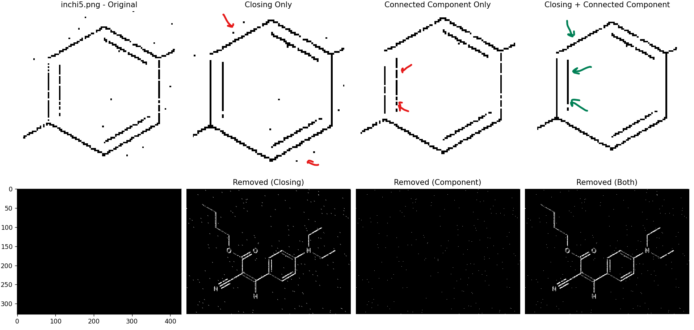

# Image pre-processing

## Contents
* [About the assignment](#about-the-repository)
* [Prerequisites](#prerequisites)
* [Getting Started](#getting-started)
* [Usage](#how-to-run-the-application)
* [References](#references)
* [Written by](#author)


## About the repository
This repository is applies different image preprocessing techniques to various images collected under *images* folder. The script is written in 3 parts (namely, *noise_removal.py*, *speckle_removal.py* and *mri.py*) for better readability and share utils.py file for some functions.  

## Notes & Observations on tasks
Task 1 - Removing the noise:
- Smaller kernel size is better when the pixels are close but they should not be connected (letters).
- Connected Component presents great advantage to remove noise which is far from the structure.
- When used together with Closing, the details are even sharper. 




Task 2 - Speckle removal with filter and Crimmins
Crimmins performs usually better than standard filtering because it adaptively adjusts each pixel based on its local neighborhood, effectively reducing noise while preserving details and edges that uniform smoothing seem to erase.


Task 3 - DICOM visualization
The script pulls the file from Google Drive, visualizes the 76 frames in one window and gives the user capability to save selected images to the folder. The user can also use button to *sharpen* the image before downloading. All selected files are saved under \outputs\dicom.


## Running the code
All the codes in this repository is written in Python programming language. In order to use the application, Python should be installed in the system. [Python](https://www.python.org/downloads/)


## Getting Started
In this section, all the necessary steps to run the applications are highlighted.

First of all, we will need the codes to be downloaded to our system. If you have git, you can directly clone the repository by:
```
git clone https://github.com/ADA-GWU/a3-digital-image-pre-processing-DDursun.git

```

You can also download all the codes from Github as a Zip file.


## How to run the application

1. Install necessary libraries:

```bash

pip install pydicom requests matplotlib opencv-python numpy


```
 
2. Open the corresponding folder path in your terminal and run the files using:

```bash

python file_name.py

```


## References
1) T. Crimmins The Geometric Filter for Speckle Reduction, Applied Optics, Vol. 24, No. 10, 15 May 1985.
2) https://homepages.inf.ed.ac.uk/rbf/HIPR2/crimmins.htm
3) https://opencv24-python-tutorials.readthedocs.io/en/latest/py_tutorials/py_imgproc/py_morphological_ops/py_morphological_ops.html
4) https://en.wikipedia.org/wiki/DICOM


## Written by
Dursun Dashdamirov
CSDA master's student.


